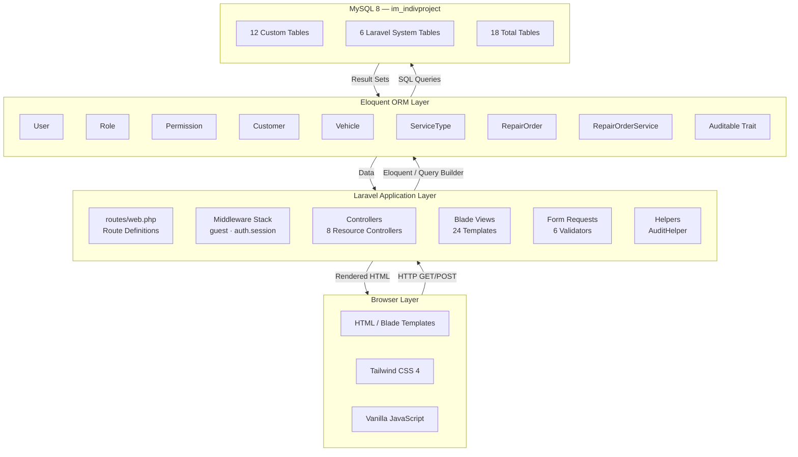
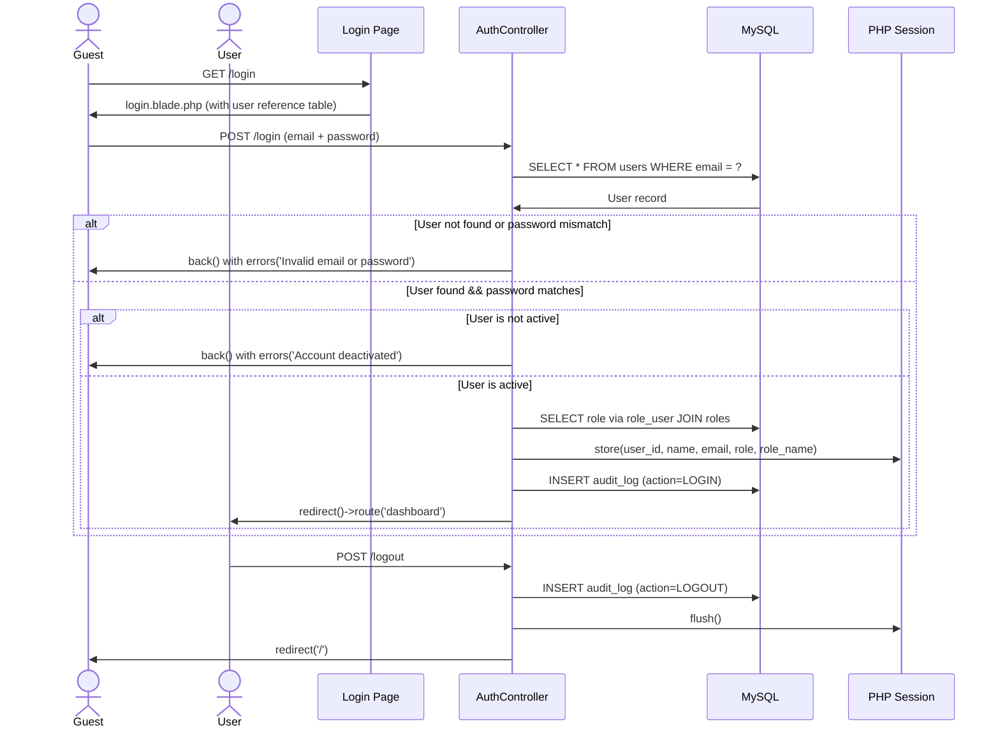
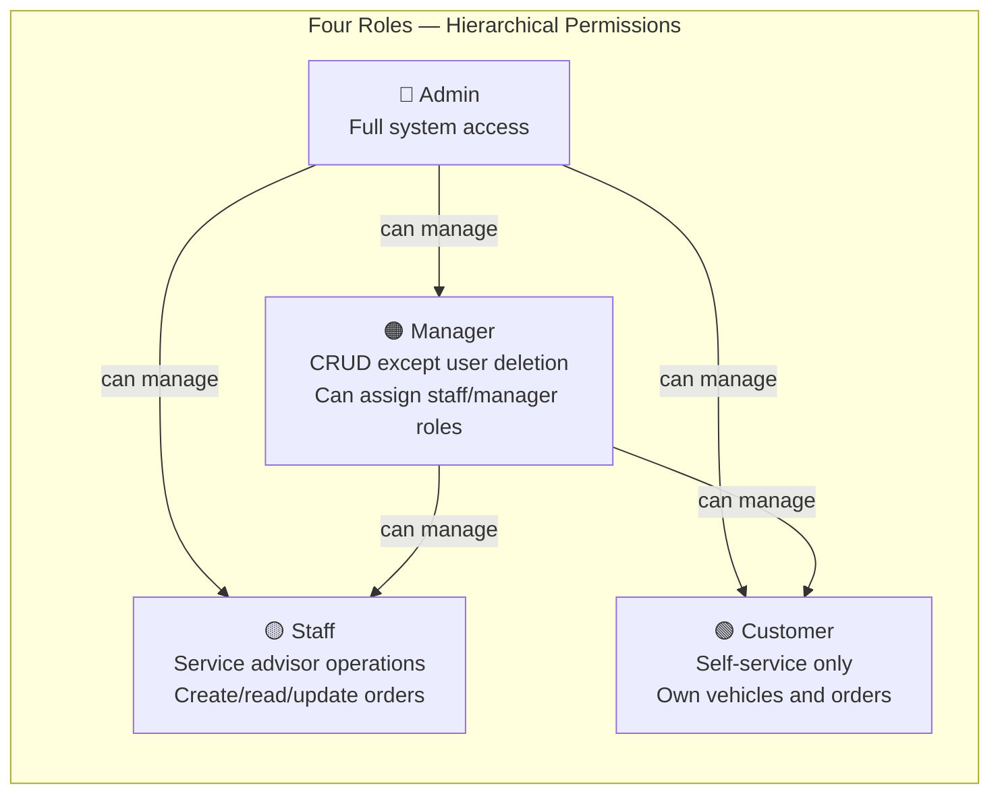
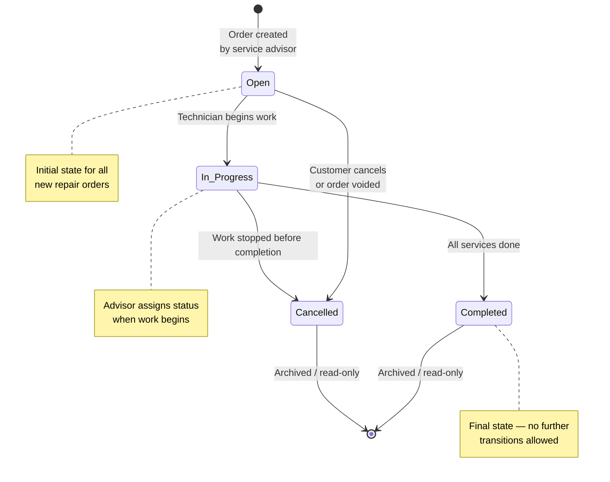
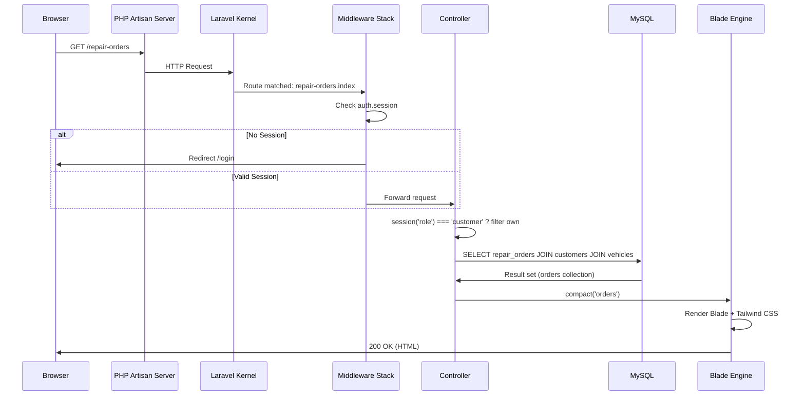
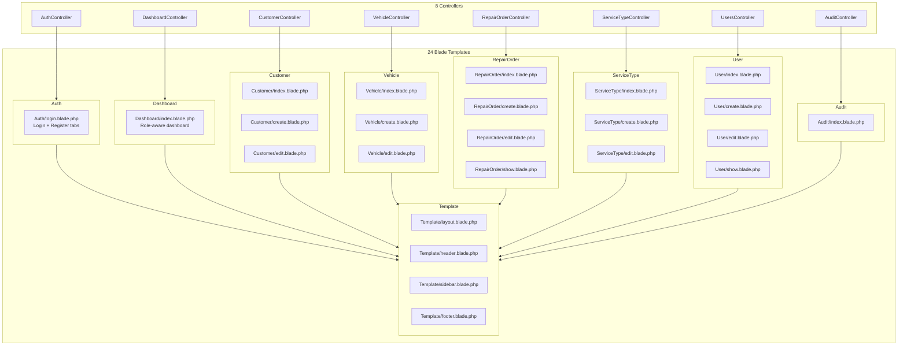
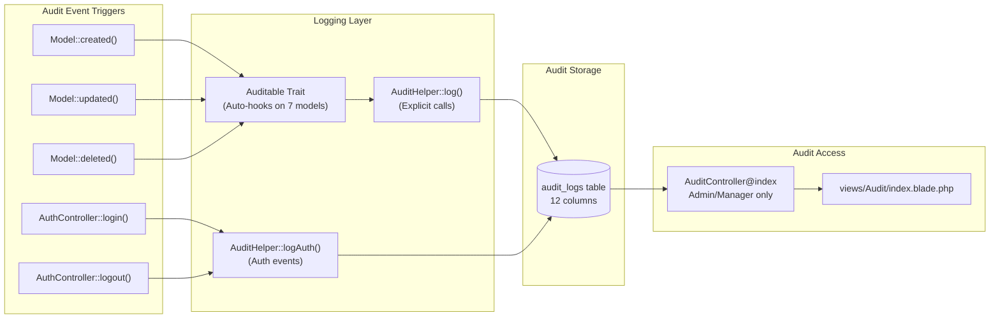
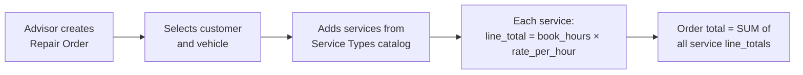

# Auto Repair Shop Management System — Comprehensive Architecture & Design Documentation

> **Project:** Information Management — Individual Project No. 3  
> **Framework:** Laravel 13.8 · PHP 8.3+ · MySQL 8 · Tailwind CSS 4  
> **Repository root:** `C:\.DIT21\IM\IndivProj`  
> **Author:** Andador, Kim Phillip  

---

## Table of Contents

1. [Project Overview](#1-project-overview)
2. [System Architecture](#2-system-architecture)
3. [Database Entity-Relationship Diagram](#3-database-entity-relationship-diagram)
4. [Authentication & Session Flow](#4-authentication--session-flow)
5. [Role-Based Access Control (RBAC)](#5-role-based-access-control-rbac)
6. [Repair Order State Machine](#6-repair-order-state-machine)
7. [HTTP Request Lifecycle](#7-http-request-lifecycle)
8. [Controller–View Relationship Map](#8-controllerview-relationship-map)
9. [Audit Trail Architecture](#9-audit-trail-architecture)
10. [Business Rules Summary](#10-business-rules-summary)
11. [Project Structure](#11-project-structure)

---

## 1. Project Overview

This project models the complete workflow of an **automobile repair shop** based on a published case study. A customer brings a vehicle to the shop; a **service advisor** writes a **repair order** that identifies the customer, vehicle, date, and one or more service line items (oil change, tire rotation, etc.). Each service type has a pre-determined `book_hours` and flat `rate_per_hour`, making the billing formula:

```
line_total = book_hours × rate_per_hour
```

The system implements **session-based authentication**, **role-based access control** (4 roles), **full CRUD** on all business entities, a **status state machine** for repair orders, and a **complete audit trail** tracking every change.

### Case Study (Original)

> *"You are designing a database for an automobile repair shop. When a customer brings in a vehicle, a service advisor will write up a repair order. This order will identify the customer and the vehicle, along with the date of service and the name of the advisor. A vehicle might need several different types of service in a single visit. These could include oil change, lubrication, rotate tires, and so on. Each type of service is billed at a pre-determined number of hours work, regardless of the actual time spent by the technician. Each type of service also has a flat book rate of dollars-per-hour that is charged."*

---

## 2. System Architecture



### Technology Stack

| Layer | Technology | Purpose |
|-------|-----------|---------|
| **Framework** | Laravel 13.8 | MVC architecture, routing, ORM, session management |
| **Language** | PHP 8.3+ | Server-side logic |
| **Database** | MySQL 8 | Persistent storage (`im_indivproject`) |
| **Authentication** | Session guard (bcrypt, 12 rounds) | Login/register/logout |
| **ORM** | Eloquent (7 models) + Query Builder (`DB::table()`) | Data access |
| **Frontend** | Blade templates + Tailwind CSS 4 + Vanilla JS | User interface |
| **Build tool** | Vite 8 | Asset compilation and HMR |
| **Testing** | PHPUnit 12 | Unit and feature tests |
| **Code style** | Laravel Pint | PSR-12 coding standards |

---

## 3. Database Entity-Relationship Diagram

### 3.1 Full Entity Relationship Map

```mermaid
erDiagram
    %% ===== RBAC ENTITIES =====
    users ||--o{ role_user : "has"
    roles ||--o{ role_user : "assigned to"
    roles ||--o{ permission_role : "has"
    permissions ||--o{ permission_role : "assigned to"

    %% ===== CORE BUSINESS ENTITIES =====
    users ||--o{ customers : "links to (optional)"
    customers ||--o{ vehicles : "owns"
    customers ||--o{ repair_orders : "brings vehicle for"
    vehicles ||--o{ repair_orders : "receives service on"
    repair_orders ||--o{ repair_order_services : "contains"
    service_types ||--o{ repair_order_services : "catalog reference"

    %% ===== AUDIT =====
    users ||--o{ audit_logs : "performs action"

    %% ===== ENTITY DEFINITIONS =====
    users {
        int id PK
        string first_name "NOT NULL"
        string last_name "NOT NULL"
        string email "UNIQUE, NOT NULL"
        string password "bcrypt hash"
        bool is_active "default 1"
        enum user_type "customer | staff"
        timestamp last_login
        timestamp created_at
        timestamp updated_at
    }

    roles {
        int id PK
        string name "UNIQUE: admin|manager|staff|customer"
        string display_name
        timestamp created_at
        timestamp updated_at
    }

    role_user {
        int user_id PK FK
        int role_id PK FK
    }

    permissions {
        int id PK
        string code "UNIQUE, e.g. manage-users"
        string description
        string module
        timestamp created_at
        timestamp updated_at
    }

    permission_role {
        int permission_id PK FK
        int role_id PK FK
    }

    customers {
        int id PK
        int user_id FK "nullable, links to users"
        string first_name "NOT NULL"
        string last_name "NOT NULL"
        string email "UNIQUE"
        string phone
        text address
        timestamp created_at
        timestamp updated_at
    }

    vehicles {
        int id PK
        int customer_id FK "NOT NULL"
        string make "NOT NULL"
        string model "NOT NULL"
        year year
        string license_plate
        string vin
        timestamp created_at
        timestamp updated_at
    }

    service_types {
        int id PK
        string name "NOT NULL"
        text description
        decimal book_hours "NOT NULL"
        decimal rate_per_hour "NOT NULL"
        timestamp created_at
        timestamp updated_at
    }

    repair_orders {
        int id PK
        int customer_id FK "NOT NULL"
        int vehicle_id FK "NOT NULL"
        string service_advisor_name "NOT NULL"
        date order_date "NOT NULL"
        enum status "open|in_progress|completed|cancelled"
        text notes
        int created_by FK "nullable"
        int updated_by FK "nullable"
        timestamp created_at
        timestamp updated_at
    }

    repair_order_services {
        int id PK
        int repair_order_id FK "NOT NULL"
        int service_type_id FK
        decimal book_hours "NOT NULL, from catalog"
        decimal rate_per_hour "NOT NULL, from catalog"
        decimal line_total "NOT NULL, book_hours * rate_per_hour"
        timestamp created_at
        timestamp updated_at
    }

    audit_logs {
        int id PK
        int user_id FK
        string username
        string action "CREATED|UPDATED|DELETED|LOGIN|LOGOUT"
        string entity_type
        int entity_id
        string summary
        json old_values
        json new_values
        string ip_address
        string user_agent
        timestamp created_at
    }
```

### 3.2 Table Groupings

| Group | Color (Concept) | Tables |
|-------|----------------|--------|
| **RBAC** | Purple | `users`, `roles`, `role_user`, `permissions`, `permission_role` |
| **Core Business** | Blue | `customers`, `vehicles`, `service_types` |
| **Orders & Services** | Yellow | `repair_orders`, `repair_order_services` |
| **Audit** | Red | `audit_logs` |
| **Laravel System** | Gray | `cache`, `jobs`, `job_batches`, `sessions`, `migrations`, `failed_jobs` |

### 3.3 Key Relationships

- **User → Customer:** A registered user *may* link to a customer record (for customer-portal access). Not all customers have user accounts.
- **Customer → Vehicle:** One customer can own many vehicles. Every vehicle belongs to exactly one customer.
- **Customer → RepairOrder:** The customer who brings in the vehicle. A customer can have many orders over time.
- **Vehicle → RepairOrder:** The specific vehicle being serviced. A vehicle can return for multiple visits.
- **RepairOrder → RepairOrderService:** One order contains many service line items. Deleting an order cascades to its services.
- **ServiceType → RepairOrderService:** Each line item references the catalog entry, but stores its own snapshot of `book_hours`, `rate_per_hour`, and `line_total` at the time the order was created.

---

## 4. Authentication & Session Flow



### Session Data Structure

After successful login, these values are stored in the PHP session:

```php
session([
    'user_id'    => $user->id,           // int
    'first_name' => $user->first_name,   // string
    'last_name'  => $user->last_name,    // string
    'email'      => $user->email,        // string
    'role'       => 'admin|manager|staff|customer',  // machine name
    'role_name'  => 'Administrator|Manager|Staff|Customer',  // display name
]);
```

### Route Protection

| Middleware | Routes | Behavior |
|-----------|--------|----------|
| `guest` | `/login`, `/register` | Redirects to `/dashboard` if already authenticated |
| `auth.session` | All other routes | Redirects to `/login` if session missing |
| Controller checks | Per-action | Role-based 403 aborts (e.g., customers cannot edit users) |

---

## 5. Role-Based Access Control (RBAC)

### 5.1 Role Hierarchy



### 5.2 Permission Matrix

| Action | Admin | Manager | Staff | Customer |
|--------|:-----:|:-------:|:-----:|:--------:|
| **User Management** | | | | |
| List users | ✅ | ✅ | ❌ | ❌ |
| Create users (staff/manager) | ✅ | ✅ | ❌ | ❌ |
| Edit users | ✅ | ✅ | ❌ | ❌ |
| Delete users | ✅ | ❌ | ❌ | ❌ |
| Assign admin role | ✅ | ❌ | ❌ | ❌ |
| **Customer Management** | | | | |
| List all customers | ✅ | ✅ | ✅ | ❌ (self only) |
| Create customers | ✅ | ✅ | ✅ | ❌ |
| Edit customers | ✅ | ✅ | ✅ | ❌ |
| Delete customers | ✅ | ✅ | ✅ | ❌ |
| **Vehicle Management** | | | | |
| List all vehicles | ✅ | ✅ | ✅ | ❌ (self only) |
| Create vehicles | ✅ | ✅ | ✅ | ❌ |
| Edit vehicles | ✅ | ✅ | ✅ | ❌ |
| Delete vehicles | ✅ | ✅ | ✅ | ❌ |
| **Service Types (Catalog)** | | | | |
| List service types | ✅ | ✅ | ✅ | ❌ |
| Create service types | ✅ | ✅ | ❌ | ❌ |
| Edit service types | ✅ | ✅ | ❌ | ❌ |
| Delete service types | ✅ | ✅ | ❌ | ❌ |
| **Repair Orders** | | | | |
| List all orders | ✅ | ✅ | ✅ | ❌ (own only) |
| Create orders | ✅ | ✅ | ✅ | ❌ |
| Edit / update orders | ✅ | ✅ | ✅ | ❌ |
| Delete orders | ✅ | ✅ | ✅ | ❌ |
| Change order status | ✅ | ✅ | ✅ | ❌ |
| Add/remove services | ✅ | ✅ | ✅ | ❌ |
| **Audit Log** | | | | |
| View audit trail | ✅ | ✅ | ❌ | ❌ |

### 5.3 Access Enforcement

Access control is enforced at **three levels**:

1. **Route middleware** — `auth.session` checks for authenticated session
2. **Controller gate logic** — role comparison via `session('role')`:
   ```php
   if (session('role') === 'customer') {
       abort(403, 'Customers cannot edit customer records.');
   }
   ```
3. **Query filtering** — Customer-scoped data access:
   ```php
   if (session('role') === 'customer') {
       $query->where('repair_orders.customer_id', $customer->id);
   }
   ```

---

## 6. Repair Order State Machine

### 6.1 Status Transitions



### 6.2 Enforcement Code

The state machine is enforced in `RepairOrder::canTransitionTo()`:

```php
$allowed = [
    'open'        => ['in_progress', 'cancelled'],
    'in_progress' => ['completed', 'cancelled'],
    'completed'   => [],
    'cancelled'   => [],
];
```

Violations return an error: `"Cannot change status from 'completed' to 'open'."`

---

## 7. HTTP Request Lifecycle



### Route Table

| Method | URI | Controller@Action | Middleware | Name |
|--------|-----|-------------------|-----------|------|
| `GET` | `/login` | `AuthController@loginPage` | `guest` | `login` |
| `GET` | `/` | `AuthController@loginPage` | `guest` | — |
| `POST` | `/login` | `AuthController@login` | `guest` | `login.post` |
| `GET` | `/register` | `AuthController@registerPage` | `guest` | `register` |
| `POST` | `/register` | `AuthController@register` | `guest` | `register.post` |
| `POST` | `/logout` | `AuthController@logout` | `auth.session` | `logout` |
| `GET` | `/dashboard` | `DashboardController@index` | `auth.session` | `dashboard` |
| `GET/POST` | `/customers`, `/vehicles`, `/repair-orders`, `/service-types`, `/users` | Resource controllers | `auth.session` | Resource routes |
| `GET` | `/audit` | `AuditController@index` | `auth.session` | `audit.index` |

---

## 8. Controller/View Relationship Map



### Helpers & Traits

| File | Role |
|------|------|
| `app/Helpers/AuditHelper.php` | Centralized `log()` and `logAuth()` methods for writing to `audit_logs` |
| `app/Models/Traits/Auditable.php` | Eloquent trait auto-hooking `created`, `updated`, `deleted` events |
| `app/Http/Requests/*` | 6 form request classes with validation rules |

---

## 9. Audit Trail Architecture

### 9.1 Flow Diagram



### 9.2 What Gets Logged

| Event | `action` | `entity_type` | Captures |
|-------|----------|---------------|----------|
| Record created | `CREATE` | Model class name | `new_values` (full row) |
| Record updated | `UPDATE` | Model class name | `old_values` + `new_values` (changed only) |
| Record deleted | `DELETE` | Model class name | `old_values` (deleted row) |
| User logs in | `LOGIN` | — | Auth metadata |
| User logs out | `LOGOUT` | — | Auth metadata |

### 9.3 Audit Log Schema

```sql
audit_logs (
    id           INT AUTO_INCREMENT PRIMARY KEY,
    user_id      INT NULL,           -- FK to users
    username     VARCHAR(255),       -- snapshot of who (survives deletion)
    action       VARCHAR(50),        -- CREATE | UPDATE | DELETE | LOGIN | LOGOUT
    entity_type  VARCHAR(100),       -- e.g. "App\Models\Customer"
    entity_id    INT NULL,
    summary      TEXT,               -- human-readable description
    old_values   JSON NULL,          -- previous field values (UPDATE, DELETE)
    new_values   JSON NULL,          -- new field values (CREATE, UPDATE)
    ip_address   VARCHAR(45),        -- IPv4 or IPv6
    user_agent   TEXT,
    created_at   TIMESTAMP
);
```

---

## 10. Business Rules Summary

### 10.1 Pricing Flow



1. `book_hours` and `rate_per_hour` are **auto-populated from the `service_types` catalog** when a service is added.
2. `line_total` is **auto-calculated** as `book_hours * rate_per_hour` at insert time.
3. The **order total** is computed dynamically via `$order->services->sum('line_total')`.

### 10.2 Status Machine Rules

| Current Status | Allowed Transitions |
|---------------|-------------------|
| `open` | `in_progress`, `cancelled` |
| `in_progress` | `completed`, `cancelled` |
| `completed` | *(none — terminal state)* |
| `cancelled` | *(none — terminal state)* |

- No backwards transitions (e.g., `completed → open` is forbidden)
- Enforced in `RepairOrder::canTransitionTo()` and `RepairOrderController@update`

### 10.3 Advisor Auto-Assignment

When a staff user creates a repair order:

```php
$advisorName = session('first_name') . ' ' . session('last_name');
```

Customer self-service orders get an empty advisor name.

### 10.4 User Type Distinction

| Registration Path | `user_type` | Role Assigned | Can create? |
|------------------|------------|--------------|------------|
| Public `/register` | `customer` | `customer` | Can only see own data |
| Admin/Manager via `/users/create` | `staff` | `admin`, `manager`, or `staff` | Full staff privileges |
| Admin/Manager via `/users/create` | `customer` | `customer` | Represents a customer account |

### 10.5 Vehicle–Customer Constraint

When creating a repair order, the **vehicle dropdown is filtered** to only show vehicles belonging to the selected customer. A server-side check enforces this:

```php
$vehicle = DB::table('vehicles')->find($request->vehicle_id);
if (!$vehicle || $vehicle->customer_id !== $customerRecord->id) {
    return back()->withErrors(['vehicle_id' => 'Invalid vehicle selection.']);
}
```

---

## 11. Project Structure

```
C:\.DIT21\IM\IndivProj\
├── app/
│   ├── Helpers/
│   │   └── AuditHelper.php              # Centralized audit event logger
│   ├── Http/
│   │   ├── Controllers/
│   │   │   ├── AuditController.php      # Audit log viewer
│   │   │   ├── AuthController.php       # Login, register, logout
│   │   │   ├── CustomerController.php   # Customer CRUD
│   │   │   ├── DashboardController.php  # Role-aware dashboard
│   │   │   ├── RepairOrderController.php # Orders + services + status
│   │   │   ├── ServiceTypeController.php # Service catalog CRUD
│   │   │   ├── UsersController.php      # User management (admin/manager)
│   │   │   └── VehicleController.php    # Vehicle CRUD
│   │   ├── Middleware/                  # auth.session guard
│   │   └── Requests/                    # 6 form request validators
│   ├── Models/
│   │   ├── Traits/
│   │   │   └── Auditable.php            # Auto-hooks model events
│   │   ├── Customer.php
│   │   ├── RepairOrder.php
│   │   ├── RepairOrderService.php
│   │   ├── Role.php
│   │   ├── ServiceType.php
│   │   ├── User.php
│   │   └── Vehicle.php
│   └── Providers/
├── bootstrap/
├── config/                              # 10 configuration files
├── database/
│   ├── factories/
│   ├── migrations/                      # 16 migration files
│   └── seeders/                         # 8 database seeders
├── docs/                                # Project documentation
│   ├── ERD MODELS/                      # Conceptual, Logical, Physical ERDs
│   ├── auto-repair-shop-db-design.drawio
│   ├── COMPREHENSIVE_DOCUMENTATION.md   # ← This file
│   ├── IM-INDIVIDUAL_PROJECT_NO3.docx
│   ├── IM-INDIVIDUAL_PROJECT_NO3.pdf
│   ├── drawio.png
│   ├── drawio.xml
│   └── logical.png
├── public/
│   ├── build/                           # Compiled Vite assets
│   └── index.php                        # Application entry point
├── resources/
│   ├── css/app.css                      # Tailwind CSS imports
│   ├── js/app.js                        # Alpine.js + vanilla JS
│   └── views/                           # 24 Blade templates
│       ├── Audit/
│       ├── Auth/
│       ├── Customer/
│       ├── Dashboard/
│       ├── RepairOrder/
│       ├── ServiceType/
│       ├── Template/                    # Layout shell (header, sidebar, footer)
│       ├── User/
│       └── Vehicle/
├── routes/
│   ├── console.php
│   └── web.php                          # 2 guest + 11 authenticated routes
├── storage/                             # Logs, cache, sessions
├── tests/
│   ├── Feature/
│   ├── Unit/
│   └── TestCase.php
├── .env                                 # Environment configuration
├── composer.json
├── package.json
└── vite.config.js
```

---

## Summary of Key Architectural Decisions

| Decision | Rationale |
|----------|-----------|
| **Session auth vs. Sanctum/JWT** | Course requirements specify login form with session authentication; no API requirement |
| **Query Builder + Eloquent hybrid** | Controllers use `DB::table()` for complex joins; models use Eloquent for relationships and auto-audit |
| **Separate `audit_logs` table** | Full history preserved independent of model lifecycle; survives soft/hard deletes |
| **Snapshot pricing on line items** | `book_hours` and `rate_per_hour` are copied at order time, so price changes to the catalog don't retroactively alter existing orders |
| **Role-based data scoping** | Customers see only their own data via query filters rather than separate endpoints — simpler to maintain |
| **4 roles with code enforcement** | Rather than a heavy permission-per-action system, role checks are concise `session('role')` comparisons in controllers |

---

*Generated: 2026-06-12 · Last updated: 2026-06-12*
